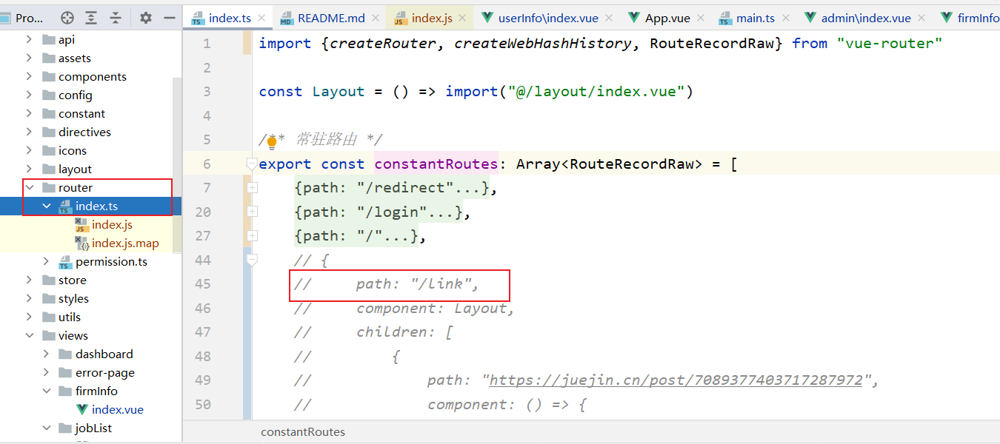
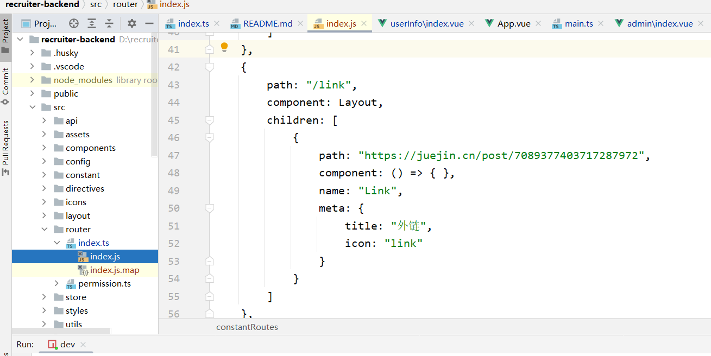
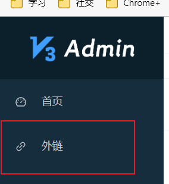

# recruiter-backend
Vue3+Ts+Element-plus实现后台管理,对接Recruiter后端
## Customize configuration

See [Vite Configuration Reference](https://vitejs.dev/config/).

## Project Setup

```sh
npm install
```

### Compile and Hot-Reload for Development

```sh
npm run dev
```

### Type-Check, Compile and Minify for Production

```sh
npm run build
```
### ts与js的坑! 
```
虽然TS规范! 必须注意的是TS是由JS构成的!!! 如果在TS文件上修改,但是不起作用的时候!
就必须在TS文件下的js文件进行修改!!
```
例如:

index.ts 中注释掉"/link"

index.ts 下的index.js 中的/link 没有进行注释, 在前端页面展示中仍然进行展示


